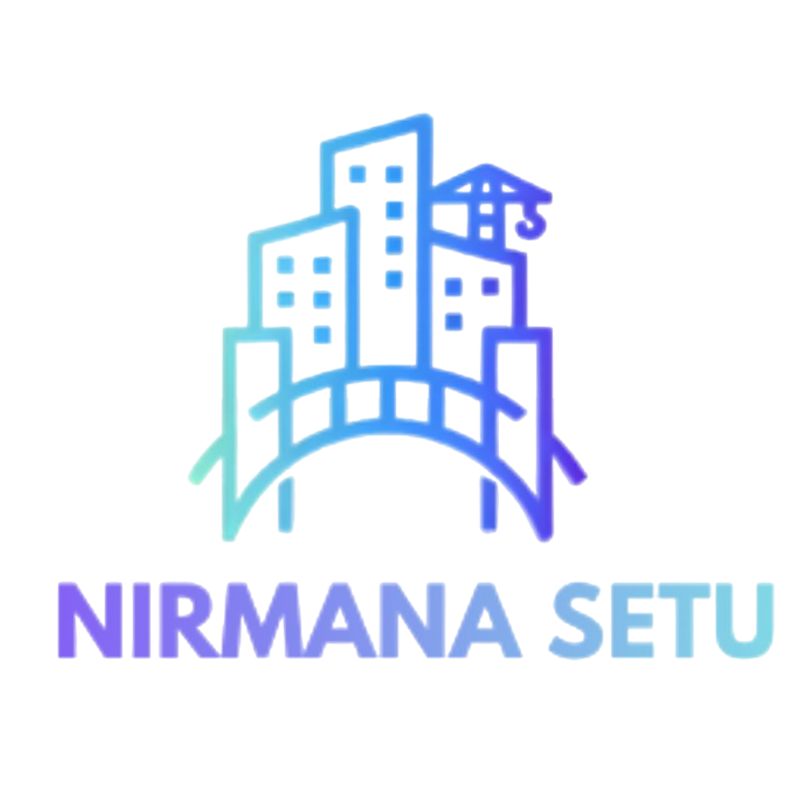

[README.md](https://github.com/user-attachments/files/33022437/README.md)
# Niramana Setu

> A Flutter-based construction project management application for
> coordinating projects, people, materials, procurement, billing,
> attendance, tools, and day-to-day site operations.



## Overview

**Niramana Setu** is a construction project management application built
with Flutter and Firebase.

The application brings multiple construction stakeholders into a single
platform and provides role-based workflows for project management, daily
progress reporting, material procurement, inventory, workforce
management, billing, attendance, tool management, and project-level
financial tracking.

The project also includes offline-first workflows, OCR-based bill
processing, on-device face recognition support, PDF generation,
multilingual UI support, and project-scoped data handling.

## Core Workflows

### Project Management

-   Create and manage construction projects
-   Project-scoped data and workflows
-   Task management
-   Milestone tracking
-   Daily Progress Reports (DPR)
-   Project reassignment
-   Project status monitoring

### Daily Progress & Site Operations

-   Create DPRs for project activities
-   Capture site information and images
-   Store selected workflows locally when offline
-   Synchronize offline data when connectivity is restored
-   Track project tasks and milestones

### Materials & Procurement

-   Material requests
-   Engineer and owner approval workflows
-   Purchase orders
-   Goods Receipt Notes (GRN)
-   Procurement status tracking
-   Inventory management
-   Project-scoped material transactions
-   Dedicated Purchase Manager workflow

### Billing & GST

-   Manual bill creation
-   OCR-assisted bill extraction using Google ML Kit
-   GSTIN validation
-   CGST / SGST / IGST calculations
-   Engineer approval and rejection workflow
-   GST bill tracking
-   PDF invoice generation
-   Invoice download and sharing

### Workforce & Attendance

-   Worker management
-   Worker enrollment
-   Attendance tracking
-   Face detection and on-device face recognition support
-   Project-based workforce management

> **Face recognition setup note:** the repository does not include the
> MobileFaceNet TensorFlow Lite model. See
> `untitled3/FACE_RECOGNITION_SETUP.md` for setup instructions.

### Tool Management

-   Tool library
-   Tool inventory
-   QR-based tool identification
-   Tool borrowing and returns
-   Tool condition tracking
-   Offline tool transactions
-   Synchronization of offline transactions

### Project Finance

-   Floor-based cash estimation
-   Total estimated project cost
-   Floor completion tracking
-   Utilized and remaining estimated amount
-   Real-time project progress calculations

### Collaboration & Ratings

-   Role-based user visibility
-   Direct communication features
-   User profiles
-   Ratings and impressions
-   Project/team feedback
-   Social-style interaction between supported project roles

### Localization

The application includes a language-selection flow and localization
support for multiple languages.

## User Roles

Niramana Setu contains role-specific dashboards and permissions for the
major participants in a construction project:

  -----------------------------------------------------------------------
  Role                                Main Responsibilities
  ----------------------------------- -----------------------------------
  **Owner / Client**                  Project oversight, progress,
                                      invoices, financial information,
                                      floor management and project
                                      feedback

  **Engineer**                        Project management, DPR review,
                                      material approvals, bill review and
                                      project/task oversight

  **Manager / Field Manager**         Daily site operations, DPRs,
                                      workers, expenses, materials,
                                      inventory and tools

  **Purchase Manager**                Procurement workflow, purchase
                                      orders, GRNs and purchasing
                                      operations
  -----------------------------------------------------------------------

The codebase supports role variants such as `ownerClient`,
`fieldManager`, `projectEngineer`, and `purchasemanager`.

## Technology Stack

### Mobile Application

-   **Flutter**
-   **Dart**
-   Material 3
-   Flutter localization

### Backend & Cloud

-   **Firebase Authentication**
-   **Cloud Firestore**
-   **Firebase Cloud Functions**
-   **Firebase Storage**
-   **Google Sign-In**

### Local / Offline Storage

-   **Hive**
-   Hive Flutter
-   Connectivity Plus
-   Offline synchronization services

### Computer Vision & OCR

-   **Google ML Kit Text Recognition**
-   **Google ML Kit Face Detection**
-   **TensorFlow Lite**
-   MobileFaceNet support for face embeddings/recognition

### Media & Documents

-   Cloudinary
-   Image Picker
-   Image compression
-   PDF generation
-   Printing
-   File sharing

### Utilities

-   HTTP
-   UUID
-   Geolocation
-   WebView
-   Internationalization/date formatting

## Architecture

At a high level, the application follows a Flutter client + Firebase
backend architecture:

``` text
                         NIRAMANA SETU
                              |
                     Flutter Application
                              |
        +---------------------+---------------------+
        |                     |                     |
   Role-Based UI        Service Layer        Local Storage
        |                     |                  (Hive)
        |                     |                     |
        +---------------------+---------------------+
                              |
                    Firebase / Cloud Services
                              |
        +-----------+-----------+-----------+-----------+
        |           |           |           |           |
      Auth      Firestore   Functions   Storage    Google Sign-In
                              |
                         Cloudinary
```

The Flutter code is organized around role-specific screens, shared
models, and service classes. Examples include:

``` text
lib/
├── auth/
├── common/
├── config/
├── engineer/
├── manager/
├── models/
├── owner/
├── purchase_manager/
├── services/
└── main.dart
```

## Project Structure

The repository currently contains the Flutter application inside
`untitled3/`.

``` text
NIRAMANA/
├── .claude/
├── .idea/
├── .vscode/
├── README.md
└── untitled3/
    ├── android/
    ├── assets/
    ├── ios/
    ├── lib/
    │   ├── auth/
    │   ├── common/
    │   ├── config/
    │   ├── engineer/
    │   ├── manager/
    │   ├── models/
    │   ├── owner/
    │   ├── purchase_manager/
    │   └── services/
    ├── test/
    ├── web/
    ├── windows/
    ├── firestore.rules
    ├── firebase.json
    └── pubspec.yaml
```

## Getting Started

### Prerequisites

Install the following before setting up the project:

-   [Flutter SDK](https://docs.flutter.dev/get-started/install)
-   Dart SDK compatible with the Flutter version being used
-   Android Studio and/or an Android device/emulator
-   Xcode for iOS development
-   A Firebase project configured for the application

The current project specifies Dart SDK `^3.10.4` in `pubspec.yaml`.

### Clone the Repository

``` bash
git clone https://github.com/SrijanRastogi/NIRAMANA.git
cd NIRAMANA
```

### Enter the Flutter Application

``` bash
cd untitled3
```

### Install Dependencies

``` bash
flutter pub get
```

### Check Your Flutter Environment

``` bash
flutter doctor
```

### Run the Application

``` bash
flutter run
```

To see available devices:

``` bash
flutter devices
```

Then run on a specific device:

``` bash
flutter run -d <device-id>
```

## Firebase Configuration

Niramana Setu uses Firebase for authentication, Firestore, storage, and
cloud functionality.

The project contains:

``` text
untitled3/
├── firebase.json
├── .firebaserc
├── firestore.rules
└── lib/firebase_options.dart
```

Before deploying or modifying the backend, make sure the Firebase
project and platform configuration match your development environment.

Firestore rules can be deployed with:

``` bash
firebase deploy --only firestore:rules
```

Cloud Functions, when configured in the Firebase project, can be
deployed using the Firebase CLI.

## Face Recognition Setup

Face recognition uses Google ML Kit for face detection and TensorFlow
Lite for on-device recognition.

The MobileFaceNet model is **not included in this repository** because
of its size.

To configure it:

``` text
untitled3/
└── assets/
    └── models/
        └── mobilefacenet.tflite
```

Then enable the model asset in `pubspec.yaml`.

See:

-   `untitled3/FACE_RECOGNITION_SETUP.md`
-   `untitled3/QUICK_START_FACE_RECOGNITION.md`

for the complete setup and troubleshooting steps.

## Offline Support

Several workflows use local storage and synchronization so selected
operations can continue when network connectivity is unavailable.

The project includes offline handling for workflows such as:

-   Daily Progress Reports
-   Material requests
-   Tool transactions
-   Tool returns
-   Cached user/profile data

The application initializes Hive and an offline synchronization service
during startup.

## Billing Workflow

The GST billing flow is role-based:

``` text
Manager
   |
   | Create bill
   | Manual entry / OCR
   v
Pending Bill
   |
   v
Engineer
   |
   | Review
   +---- Reject
   |
   +---- Approve
   v
Approved Bill
   |
   v
Owner
   |
   | View / Download
   v
PDF Invoice
```

The billing implementation supports GST calculations, OCR extraction,
approval/rejection, project scoping, and PDF generation.

See `untitled3/GST_BILLING_IMPLEMENTATION.md` for implementation
details.

## Procurement Workflow

The procurement workflow follows a status-driven process:

``` text
REQUESTED
    ↓
ENGINEER_APPROVED
    ↓
OWNER_APPROVED
    ↓
PO_CREATED
    ↓
GRN_CONFIRMED
    ↓
BILL_GENERATED
    ↓
BILL_APPROVED
```

The project includes a dedicated Purchase Manager role and procurement
services for material requests, purchase orders, GRNs, and related
billing operations.

See:

-   `untitled3/PROCUREMENT_README.md`
-   `untitled3/PROCUREMENT_WORKFLOW_IMPLEMENTATION.md`
-   `untitled3/STATUS_FLOW_REFERENCE.md`

## Useful Documentation

The repository contains detailed implementation documents for individual
modules:

  ------------------------------------------------------------------------------
  Document                                   Purpose
  ------------------------------------------ -----------------------------------
  `FACE_RECOGNITION_SETUP.md`                Face recognition model setup

  `GST_BILLING_IMPLEMENTATION.md`            GST billing and invoice workflow

  `PROCUREMENT_README.md`                    Procurement system overview

  `PROCUREMENT_WORKFLOW_IMPLEMENTATION.md`   Procurement implementation details

  `FLOOR_BASED_CASH_ESTIMATION.md`           Floor-based project cash estimation

  `SOCIAL_FEATURE_IMPLEMENTATION.md`         Social features and role-based
                                             visibility

  `BUILD_COMMANDS.md`                        Flutter build, analysis and
                                             troubleshooting commands

  `TOOL_LIBRARY_IMPLEMENTATION.md`           Tool library implementation

  `OFFLINE_SYNC` related services            Offline data handling and
                                             synchronization
  ------------------------------------------------------------------------------

## Development Commands

### Analyze

``` bash
flutter analyze
```

### Run Tests

``` bash
flutter test
```

### Debug APK

``` bash
flutter build apk --debug
```

### Release APK

``` bash
flutter build apk --release
```

### Android App Bundle

``` bash
flutter build appbundle --release
```

For additional build and troubleshooting commands, see
`untitled3/BUILD_COMMANDS.md`.

## Screenshots

Screenshots can be added here as the project presentation is finalized.

Recommended screenshots:

1.  Login / registration
2.  Owner dashboard
3.  Engineer dashboard
4.  Field Manager dashboard
5.  Purchase Manager dashboard
6.  Project details
7.  DPR workflow
8.  Procurement workflow
9.  GST billing
10. Tool library
11. Attendance / face recognition
12. Floor-based cash estimation

## Contributing

If you are working on Niramana Setu as part of the development team:

1.  Fork the repository.
2.  Create a feature branch.

``` bash
git checkout -b feature/<feature-name>
```

3.  Make your changes.
4.  Run analysis and tests.

``` bash
flutter analyze
flutter test
```

5.  Commit your changes.

``` bash
git add .
git commit -m "feat: describe your change"
```

6.  Push the branch.

``` bash
git push origin feature/<feature-name>
```

7.  Open a Pull Request.

## Contributors

Niramana Setu is developed collaboratively by the project team.

Add the project contributors and their GitHub profiles here.

## Status

The repository contains an actively developed Flutter application with
multiple implemented construction-management workflows and supporting
implementation documentation.

## License

No explicit open-source license is currently specified in the
repository.

If this project is intended to be publicly distributed or open-sourced,
add an appropriate `LICENSE` file before selecting an open-source
license in this README.
